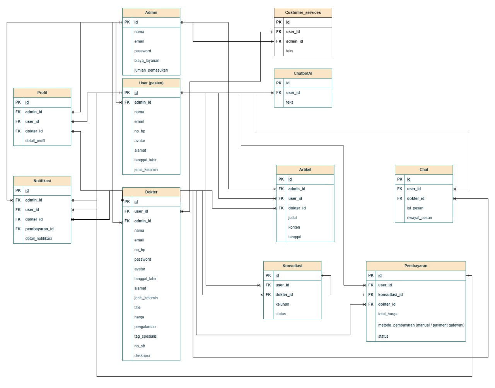
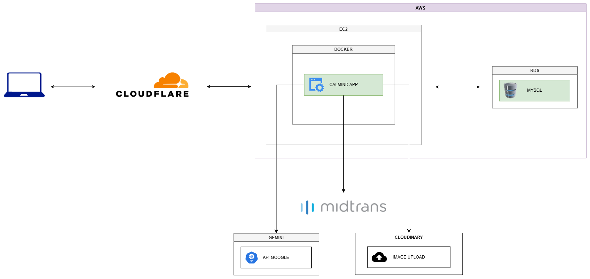
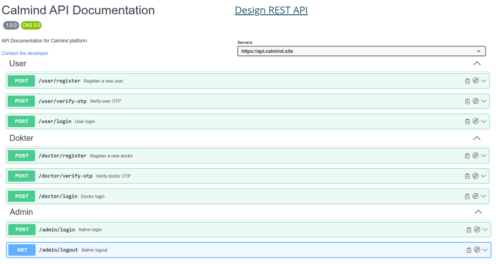

# Calmind - Mental Health Care

## 📖 Latar Belakang

Kesehatan mental adalah aspek penting dari kesejahteraan individu. Namun, masih banyak hambatan dalam mendapatkan akses yang memadai, seperti stigma sosial, kurangnya informasi, dan minimnya fasilitas yang mendukung.
Calmind hadir sebagai solusi digital untuk memberikan layanan kesehatan mental yang mudah diakses dan efisien, memberdayakan pengguna untuk memperoleh bantuan dan informasi sesuai kebutuhan mereka.

---

## ✨ Fitur Utama

- *Layanan Konsultasi Online*: Pengguna dapat berkonsultasi langsung dengan dokter ahli kesehatan mental secara online.
- *Chatbot AI*: Chatbot berbasis AI untuk menjawab pertanyaan dasar dan memberikan informasi cepat.
- *Manajemen Pertanyaan Customer Service*: Sistem pengelolaan pertanyaan pengguna yang efisien melalui modul Customer Service.
- *Autentikasi Aman*: Sistem autentikasi berbasis JWT untuk keamanan data pengguna.
- *Dokumentasi API Lengkap*: Mendukung pengembang lain dengan dokumentasi API yang komprehensif.

---

## 📋 Daftar Isi

1. [ERD (Entity Relationship Diagram)](#erd-entity-relationship-diagram)
2. [High-Level Architecture](#high-level-architecture)
3. [Dokumentasi API](#dokumentasi-api)
4. [Contoh Hasil Postman](#contoh-hasil-postman)
5. [Tools yang Digunakan](#tools-yang-digunakan)

---

## 🗂 ERD (Entity Relationship Diagram)

Berikut adalah diagram relasi antar-entitas yang digunakan dalam basis data proyek ini:

## 🏗 High-Level Architecture

Desain arsitektur berikut menunjukkan bagaimana berbagai komponen dalam aplikasi saling berinteraksi:

---

## 📜 Dokumentasi API

Berikut adalah dokumentasi API untuk semua endpoint yang tersedia di aplikasi ini:
[Link ke Dokumentasi API (Swagger/OpenAPI)](https://app.swaggerhub.com/apis/BARMONOBERUTU_1/calmind/1.0.0)

## 📬 Contoh Hasil Postman

### *Fitur Autentikasi User*

| No | Method | Endpoint        | Request Body                                         | Deskripsi                                  |
| -- | ------ | :-------------- | ---------------------------------------------------- | ------------------------------------------ |
| 1  | POST   | user/register   | { "email": "test@example.com", "password": "12345" } | Registrasi pengguna baru                   |
| 2  | POST   | user/verify-otp | { "email": "test@example.com", "otp": "123456" }     | Verifikasi OTP setelah registrasi          |
| 3  | POST   | user/resend-otp | { "email": "test@example.com" }                      | Mengirim ulang OTP jika OTP tidak diterima |
| 4  | POST   | user/login      | { "email": "test@example.com", "password": "12345" } | Login pengguna dan mendapatkan token       |

### *Fitur Autentikasi Doctor*

| No | Method | Endpoint          | Request Body                                         | Deskripsi                                  |
| -- | ------ | ----------------- | ---------------------------------------------------- | ------------------------------------------ |
| 1  | POST   | doctor/register   | { "email": "test@example.com", "password": "12345" } | Registrasi doctor                          |
| 2  | POST   | doctor/verify-otp | { "email": "test@example.com", "otp": "123456" }     | Verifikasi OTP setelah registrasi          |
| 3  | POST   | doctor/resend-otp | { "email": "test@example.com" }                      | Mengirim ulang OTP jika OTP tidak diterima |
| 4  | POST   | doctor/login      | { "email": "test@example.com", "password": "12345" } | Login doctor dan mendapatkan token         |

### *Fitur Chatbot AI User*

| No | Method | Endpoint     | Request Body                                                      | Deskripsi                                                                                            |
| -- | ------ | ------------ | ----------------------------------------------------------------- | ---------------------------------------------------------------------------------------------------- |
| 1  | POST   | user/chatbot | { "question": "Saya merasa cemas, apa yang harus saya lakukan?" } | Mengajukan pertanyaan ke chatbot AI untuk mendapatkan saran atau informasi terkait kesehatan mental. |

### *Fitur Chatbot AI Recommendation Doctor*

| No | Method | Endpoint       | Request Body                                                        | Deskripsi                                                                                                        |
| -- | ------ | -------------- | ------------------------------------------------------------------- | ---------------------------------------------------------------------------------------------------------------- |
| 1  | POST   | doctor/chatbot | { "message": "Apa rekomendasi untuk pasien yang mengalami stress" } | Mengajukan pertanyaan ke chatbot AI untuk mendapatkan saran rekomendasi atau informasi terkait kesehatan mental. |

### *Fitur Customer Service*

| No | Method | Endpoint          | Request Body                                     | Deskripsi                                                                       |
| -- | ------ | ----------------- | ------------------------------------------------ | ------------------------------------------------------------------------------- |
| 1  | GET    | /customer-service | -                                                | Mendapatkan daftar pertanyaan umum yang sering diajukan kepada Customer Service |
| 2  | POST   | /customer-service | { "question": "Bagaimana cara mendaftar akun?" } | Mengirimkan pertanyaan baru ke Customer Service untuk mendapatkan jawaban       |

*Response Contoh:*

json
{
    "data": {
        "1": "Metode pembayaran?",
        "2": "Proses pembayaran?",
        "3": "Kapan harus melakukan konsultasi?",
        "4": "Bagaimana cara melakukan konsultasi?",
        "5": "Bagaimana cara mendaftar akun?",
        "6": "Apa yang harus dilakukan jika tidak bisa masuk?",
        "7": "Bagaimana jika lupa kata sandi?"
    },
    "success": true
}

## 🛠 Tools yang Digunakan

Berikut adalah tools dan teknologi yang digunakan dalam proyek  Calmind :

* *Backend Framework* : [Echo]() (Golang)
* *Database ORM* : [GORM](https://gorm.io/) (ORM Library untuk Golang)
* *Database* : [RDS](https://aws.amazon.com/rds/) (Amazon Relational Database Service)
* *Deployment* : [EC2](https://aws.amazon.com/ec2/) (Amazon Elastic Compute Cloud)
* *Authentication* : [JWT](https://jwt.io/) (JSON Web Token)
* *API Testing* : [Postman](https://www.postman.com/)
* *Documentation* : [Swagger/OpenAPI](https://swagger.io/)
* *AI Integration* : [Gemini API](https://www.gemini.com/) (Untuk fungsi Chatbot AI)
* *Version Control* : [Git](https://git-scm.com/) (Git Version Control)
* *Containerization* : [Docker](https://www.docker.com/)
* *IDE* : [Visual Studio Code](https://code.visualstudio.com/) (IDE untuk pengembangan)
